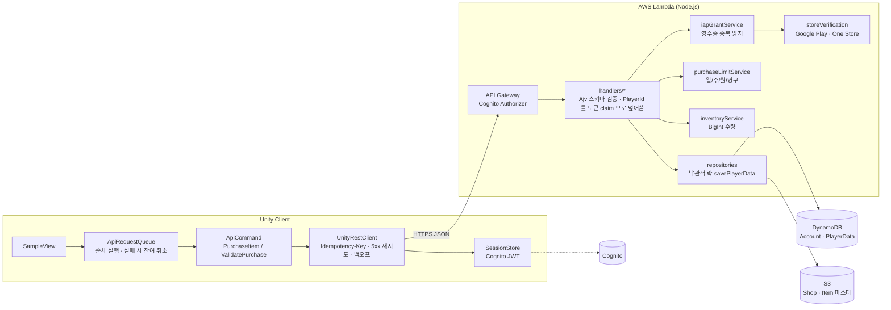

# ⛏️ 광여전사 키우기 REST API 샘플

> 상용 Unity 모바일 RPG **광여전사 키우기**(서비스 중)에서 사용하는 클라이언트-서버 통신 구조를 포트폴리오용으로 재구성한 샘플입니다.

Unity 클라이언트가 AWS Lambda 기반 백엔드와 REST API로 통신하는 흐름을 보여줍니다. 서버 권한 기반 구매 처리, 낙관적 락으로 동시 요청 보호, 결제 영수증 검증과 중복 지급 방지, 구매 제한, 인벤토리 동기화 구조를 중심으로 구성했습니다.

[](https://github.com/jhp8869/unity-aws-rest-api-sample/actions/workflows/lambda-tests.yml)

- 출시 앱: https://play.google.com/store/apps/details?id=com.onethesoft.MiningWarrior&hl=ko

## 프로젝트 스펙

### Unity 클라이언트

- Unity Editor: `6000.3.8f1` (Unity 6)
- Language: C#
- REST transport: `UnityWebRequest`
- Serialization: `Newtonsoft.Json`
- Store integration: Unity IAP, One Store SDK

### AWS 서버리스 백엔드

- Entry point: AWS API Gateway
- Compute: AWS Lambda, Node.js `22.x`
- Handler: `index.handler`
- Architecture: `x86_64`
- Authentication: Amazon Cognito
- Data: Amazon DynamoDB, Amazon S3
- Lambda layer: `ajv_nodejs18`

이 프로젝트는 Lightsail의 상시 실행 인스턴스나 nginx/PM2를 사용하지 않는다. API Gateway가 Lambda를 호출하고, Lambda가 DynamoDB와 S3에 접근하는 서버리스 구조다.

## 30초 요약

| 문제 | 해결 | 검증 |
|---|---|---|
| Lambda 는 요청마다 병렬 실행 — 같은 플레이어의 구매 두 건이 같은 스냅샷을 읽고 각자 저장하면 재화가 한 번만 차감됨 | `Version` 컬럼 + DynamoDB `ConditionExpression` 낙관적 락, 충돌 시 `Conflict` 로 거부 | `purchaseItem.test.mjs` — 동시 구매 시 하나만 성공, 잔액 정확 |
| 응답 유실/재설치 후 같은 영수증이 다시 올라와 보상이 두 번 지급됨 | `ProcessedReceipts[store:purchaseToken]` 에 결과 기록, 재요청엔 스토어 API 호출 없이 이전 결과를 **성공으로** 반환 | `validatePurchase.test.mjs` — 두 번 보내도 지급 1회, 스토어 검증 1회 |
| 여러 상품 동시 구매 중 하나가 실패하면 일부만 구매된 상태가 남음 | 메모리 안에서 전부 검증·적용 후 마지막에 한 번 저장 (all-or-nothing) | `multi-item purchase is all-or-nothing` |
| 주간 구매 제한이 목요일에 리셋됨 (epoch 7일 단위 계산 버그) | ISO 8601 주(월요일 시작) 키로 비교, 일간 제한은 플레이어 시간대 자정 기준 | `purchaseLimitService.test.mjs` |
| 클라이언트가 4xx 에도 재시도하고, 재시도 요청을 서버가 구분할 수 없음 | 연결 오류/5xx 만 재시도, 모든 시도에 같은 `Idempotency-Key` 헤더 | `UnityRestClient.cs` |
| 큐 앞 명령이 실패해도 뒤 명령이 남아 있다가 엉뚱한 상태에서 실행됨 | 실패 시 남은 명령 전부 취소 + `Failed` 이벤트로 UI 복구 | `ApiRequestQueue.cs` |

## 아키텍처



## 실행과 테스트

```bash
cd Lambda
npm install
npm test        # node:test, AWS 없이 인메모리 repositories 로 핸들러 전체 실행 (24 tests)
```

핸들러는 `createHandler({ repositories, storeVerification, now })` 형태로 의존성을 주입받습니다. 배포용 `handler` 는 실제 DynamoDB/S3/스토어 API 를 쓰고, 테스트는 `tests/fixtures.mjs` 의 인메모리 구현(낙관적 락 동작까지 재현)을 넣어 스키마 검증 → 계정 상태 → 구매 제한 → 재화 차감 → 지급 → 저장까지 한 번에 검증합니다.

```text
✔ purchase consumes currency, grants product and rewards, saves once
✔ multi-item purchase is all-or-nothing: second item failing rolls back the first
✔ daily purchase limit is enforced and resets on the next local day
✔ concurrent purchases on the same snapshot: one wins, the other gets Conflict (no double spend)
✔ same receipt sent twice grants once and returns the previous result
✔ rejected receipt returns InvalidPurchase (not a server error) and saves nothing
✔ weekly limit uses ISO weeks starting Monday (regression: epoch weeks started on Thursday)
```

## 설계 결정과 트레이드오프

**서버 권한 구조.** 재화 차감, 아이템 지급, 구매 제한 판정은 전부 서버에서 하고 클라이언트는 결과를 반영만 합니다. 클라이언트가 보낸 `PlayerId` 는 신뢰하지 않고 API Gateway Cognito authorizer 가 검증한 토큰의 claim 으로 덮어씁니다.

**낙관적 락 vs 클라이언트 직렬화.** 클라이언트 `ApiRequestQueue` 가 요청을 하나씩 보내므로 정상 상황에서 충돌은 거의 없습니다. 그래도 서버에 낙관적 락을 둔 이유는, 클라이언트 큐는 조작 가능하고(치트), 같은 계정이 두 기기에서 접속할 수 있으며, 운영 툴이 같은 데이터를 동시에 수정할 수 있기 때문입니다. 비관적 락(DynamoDB 에는 없음)이나 트랜잭션 대신 `Version` 조건부 쓰기를 택한 건 읽기 1회 + 쓰기 1회로 끝나 비용이 가장 낮고, 충돌 시 클라이언트가 최신 데이터를 다시 받고 재시도하면 되기 때문입니다.

**영수증 중복 방지가 `Idempotency-Key` 와 별개인 이유.** 앱 재설치 후 Unity IAP 가 미완료 주문을 다시 올려주면 요청 키는 새것이지만 `purchaseToken` 은 같습니다. 그래서 스토어 토큰을 플레이어 데이터에 기록하고, 이미 처리한 영수증은 스토어 API 를 다시 호출하지 않고 **성공 + 이전 결과**를 돌려줍니다. 에러를 돌려주면 클라이언트가 pending order 를 confirm 하지 못해 다음 실행마다 같은 영수증이 올라옵니다. One Store 는 검증과 consume 이 한 호출이라 두 번째 호출이 실패하므로, 이 기록이 없으면 첫 지급이 저장에 실패했을 때 보상이 영구히 유실됩니다.

**스토어 검증 실패는 4xx 다.** 이전 구현은 스토어 거부를 `InternalServerError` 로 돌려줘서 클라이언트가 재시도했습니다. 재시도해도 결과가 같으므로 `InvalidPurchase` 전용 코드로 분리하고, 클라이언트 `ApiError.IsRetryable` 은 네트워크/5xx/Conflict 만 재시도 대상으로 봅니다.

**수량을 문자열로 저장.** 방치형 게임의 재화는 `2^53` 을 넘기 쉽습니다. DynamoDB Number 도 38자리까지 가능하지만 JS `number` 로 읽는 순간 정밀도가 깨지므로 서버는 `BigInt` 로 계산하고 문자열로 저장합니다 (`inventoryService.test.mjs`).

**구매 제한 시간 경계.** 일간 제한은 UTC 자정이 아니라 플레이어 시간대(`Account.Timezone`) 자정에 리셋합니다. 한국 유저는 UTC 자정이 오전 9시라 "하루 2회" 상품이 아침에 리셋되는 이상한 경험을 하기 때문입니다.

## 원본 프로젝트에서 더 다룬 것 (이 샘플에 없는 부분)

- **인증**: Google Play Games 인증 코드 → Cognito 사용자 풀 로그인/가입, 토큰 갱신
- **API 구성**: 로그인/토큰 갱신, 서버 시간, 앱 버전 확인, 닉네임, 인벤토리·플레이어 데이터 조회/저장, 상점 구매, Google Play 결제 검증, 쿠폰 조회/사용 등 13종. 재화·결제처럼 돈이 걸린 경로만 서버 권한으로 두고, 나머지 진행 데이터는 클라이언트가 계산해 `SetPlayerData` 로 저장하는 하이브리드 구조
- **운영 기능**: 랭킹, 푸시 알림(Amazon SNS), 점검 모드, 쿠폰, 어드민 로그인
- **인프라**: API Gateway + Lambda + DynamoDB + S3, 스테이지(dev/prod) 분리, 환경변수/Secret Manager 로 키 주입
- **이후 프로젝트(템빨 용병단)** 에서는 이 REST 구조를 WebSocket 상시 연결 서버로 옮겼습니다 → [unity-websocket-game-server-sample](https://github.com/jhp8869/unity-websocket-game-server-sample)

## ✨ 주요 기능

- 🔐 **로그인/인증**: 게임 서버 이용을 위한 사용자 인증 처리
- 🛒 **상점 구매**: 게임 내 재화 상품 구매 및 결과 반영
- 💳 **결제 검증**: Google Play / One Store 인앱 결제 영수증 검증
- 🎁 **보상 지급**: 구매 성공 시 아이템 지급 결과 동기화
- ⏳ **구매 제한**: 일일/주간/월간/영구 구매 제한 처리
- 🚫 **예외 처리**: 재화 부족, 잘못된 요청, 정지 계정 등 오류 응답 처리

## 🎮 Unity SampleView

서버 API 구조뿐 아니라 Unity 화면에서 사용자가 버튼을 눌렀을 때 어떤 순서로 서버 기능이 호출되는지도 함께 보여줍니다.

- `ShopPurchaseSampleView.cs`: 상점 상품 버튼 클릭 → `PurchaseItemCommand` 큐 등록 → 서버 구매 검증 → 인벤토리 UI 반영
- `PurchaseValidationSampleView.cs`: Unity IAP 결제 결과 수신 → Google Play 영수증 서버 검증 요청 → 검증 성공 후 보상 동기화

결제 보상은 클라이언트에서 직접 지급하지 않고, 서버 검증 결과를 기준으로 인벤토리에 반영하는 흐름으로 구성했습니다.
## 🚀 API 흐름

### 1. 로그인

Unity 클라이언트가 provider authorization code를 서버로 전달합니다. 서버는 provider 사용자 식별자를 내부 플레이어 식별자로 변환하고, Cognito를 통해 로그인 세션을 발급합니다.

```text
Unity Client
  → LoginWithProvider API
  → Provider 사용자 식별자 변환
  → Cognito 로그인/가입
  → IdToken, AccessToken, RefreshToken 반환
```

관련 파일:

- `Unity/Runtime/Network/LoginApi.cs`
- `Lambda/handlers/loginWithProvider.mjs`
- `Lambda/shared/authService.mjs`

### 2. 일반 재화 구매

클라이언트는 구매할 상점 ID와 상품 ID 목록을 서버로 전달합니다. 서버는 플레이어 계정 상태, 선택 서버, 보유 재화, 상점 데이터, 아이템 데이터를 검증한 뒤 인벤토리를 갱신하고 변경 결과를 반환합니다.

```text
구매 버튼 클릭
  → PurchaseItemCommand 큐 등록
  → PurchaseItem API 호출
  → 서버에서 재화/상점/아이템 검증
  → DynamoDB 플레이어 데이터 갱신
  → 클라이언트 인벤토리 동기화
```

관련 파일:

- `Unity/Runtime/Network/PurchaseItemApi.cs`
- `Unity/Runtime/Network/PurchaseItemCommand.cs`
- `Lambda/handlers/purchaseItem.mjs`
- `Lambda/shared/inventoryService.mjs`

### 3. Google Play 결제 검증

Unity IAP에서 발생한 pending order의 영수증을 서버로 전송합니다. 서버는 Google Play Developer API로 영수증을 검증한 뒤, 검증된 상품에 대해서만 보상을 지급합니다. 클라이언트는 서버 검증이 성공한 후 Unity IAP pending order를 confirm합니다.

```text
Unity IAP 구매 완료
  → PendingOrder 수신
  → ValidateGooglePlayPurchase API 호출
  → Google Play Developer API 검증
  → 서버 보상 지급
  → 클라이언트 인벤토리 반영
  → ConfirmPurchase 호출
```

관련 파일:

- `Unity/Runtime/Network/UnityIapGooglePurchaseService.cs`
- `Unity/Runtime/Network/ValidatePurchaseApi.cs`
- `Unity/Runtime/Network/ValidatePurchaseCommand.cs`
- `Lambda/handlers/validateGooglePurchase.mjs`
- `Lambda/shared/storeVerification.mjs`

### 4. One Store 결제 검증

One Store SDK에서 반환한 구매 정보를 서버로 전송합니다. 서버는 One Store API를 통해 결제 정보를 검증 및 consume 처리한 뒤, 검증된 상품에 대해서만 보상을 지급합니다.

```text
One Store 구매 완료
  → PurchaseData 수신
  → ValidateOneStorePurchase API 호출
  → One Store API 검증 및 consume
  → 서버 보상 지급
  → 클라이언트 인벤토리 반영
```

관련 파일:

- `Unity/Runtime/Network/OneStorePurchaseService.cs`
- `Unity/Runtime/Network/ValidatePurchaseApi.cs`
- `Lambda/handlers/validateOneStorePurchase.mjs`
- `Lambda/shared/storeVerification.mjs`

## 📁 프로젝트 구조

```text
Unity/
  Runtime/
    Network/
      ApiError.cs                       # 에러 모델, ApiErrorCode, IsRetryable
      ApiClientBootstrap.cs             # 씬에서 UnityRestClient/SessionStore 생성
      ApiResponse.cs                    # 공통 응답 래퍼
      ApiRequestQueue.cs                # 순차 API 요청 큐, 실패 시 잔여 취소
      AuthType.cs                       # 인증 타입
      IApiRequest.cs                    # API 요청 인터페이스
      ISessionStore.cs                  # 세션 저장소 인터페이스
      LoginApi.cs                       # 로그인 요청/응답 모델
      PurchaseItemApi.cs                # 일반 구매 요청/응답 모델
      PurchaseItemCommand.cs            # 구매 API 실행 및 인벤토리 반영
      StorePurchaseService.cs           # 스토어 결제 공통 서비스
      StoreReceiptModels.cs             # 영수증 모델
      UnityIapGooglePurchaseService.cs  # Google Play 결제 처리
      OneStorePurchaseService.cs        # One Store 결제 처리
      ValidatePurchaseApi.cs            # 결제 검증 요청/응답 모델
      ValidatePurchaseCommand.cs        # 결제 검증 API 실행
      SessionStore.cs                   # 세션 저장 구현
      UnityRestClient.cs                # UnityWebRequest REST 클라이언트, Idempotency-Key, 5xx 재시도
  SampleView/
    ShopPurchaseSampleView.cs           # 상점 구매 → 큐 → 결과/실패 UI
    PurchaseValidationSampleView.cs     # 영수증 검증 → 보상 반영

Lambda/
  package.json                          # npm test
  handlers/                             # createHandler(deps) 로 의존성 주입, handler = 배포용
    loginWithProvider.mjs               # provider 로그인 및 Cognito 세션 발급
    purchaseItem.mjs                    # 일반 재화 구매 처리
    validateGooglePurchase.mjs          # Google Play 영수증 검증
    validateOneStorePurchase.mjs        # One Store 영수증 검증

  shared/
    apiResponse.mjs                     # 공통 응답 생성, ErrorCode
    iapGrantService.mjs                 # 영수증 검증 → 중복 방지 → 지급 공통 흐름
    authService.mjs                     # Cognito 인증 처리
    iapRewardService.mjs                # IAP 보상 계산
    inventoryService.mjs                # 아이템 지급/재화 차감
    logger.mjs                          # 로깅 유틸
    purchaseLimitService.mjs            # 구매 제한 검증
    repositories.mjs                    # DynamoDB/S3 접근, Version 기반 낙관적 락
    storeVerification.mjs               # 스토어 영수증 검증
  tests/
    fixtures.mjs                        # 인메모리 repositories (낙관적 락 재현)
    purchaseItem.test.mjs
    validatePurchase.test.mjs
    purchaseLimitService.test.mjs
    inventoryService.test.mjs

.github/workflows/lambda-tests.yml      # push/PR 마다 npm test
```

## 🛠️ 기술 스택

### Client

- **Unity / C#**: 모바일 게임 클라이언트
- **UnityWebRequest**: REST API 통신
- **Newtonsoft.Json**: JSON 직렬화/역직렬화
- **Unity IAP**: Google Play 인앱 결제 처리
- **One Store SDK**: One Store 인앱 결제 처리

### Backend

- **AWS Lambda / Node.js 22.x**: 서버리스 API 핸들러
- **Amazon Cognito**: 사용자 인증 및 JWT 세션 발급
- **Amazon DynamoDB**: 계정/플레이어 데이터 저장
- **Amazon S3**: 상점/아이템 마스터 데이터 저장
- **Ajv**: Lambda 요청 스키마 검증

### Store APIs

- **Google Play Developer API**: Google Play 결제 영수증 검증
- **One Store IAP API**: One Store 결제 검증 및 consume 처리

## 에러 코드

| retCode | 의미 | 클라이언트 처리 |
|---|---|---|
| 0 | Success | |
| 1 | InvalidInput | 요청 형식/데이터 오류 — 로그 |
| 2 | NotAuthorized | 토큰 갱신 후 재시도, 실패 시 로그인 화면 |
| 3 | AccountNotFound | 가입 흐름으로 |
| 4 | InternalServerError | 같은 `Idempotency-Key` 로 재시도 |
| 5 | LackResources | 재화 부족 UI |
| 6 | BannedPlayer | 정지 안내 |
| 7 | Conflict | 플레이어 데이터 재조회 후 재시도 |
| 8 | InvalidPurchase | 스토어가 거부한 영수증 — 재시도 금지 |
| 9 | PurchaseLimitExceeded | 구매 제한 UI |

## 🔐 보안 및 공개 범위

이 저장소는 포트폴리오 공개를 위해 재작성된 샘플입니다. 실제 운영 프로젝트의 민감 정보는 포함하지 않았습니다.

제거 또는 샘플화한 항목:

- 실제 AWS 계정 정보
- AWS Access Key / Secret Key
- API Gateway 실제 엔드포인트
- Cognito User Pool ID / App Client ID
- DynamoDB 실제 테이블명
- S3 실제 버킷명
- Google Play 서비스 계정 키
- One Store client secret
- 실제 상품 ID 및 라이브 서비스 데이터

서버에서 필요한 값은 환경변수나 Secret Manager를 통해 주입하는 것을 전제로 작성했습니다.

## 📌 안내

이 저장소는 전체 실행 가능한 Unity 프로젝트나 Lambda 배포 패키지가 아니라, 구조와 설계 흐름을 보여주기 위한 코드 샘플입니다.

실제 실행을 위해서는 Unity 프로젝트 설정, Unity IAP/One Store SDK, Lambda 배포 설정, AWS 리소스, 스토어 API 인증 정보가 별도로 필요합니다.
