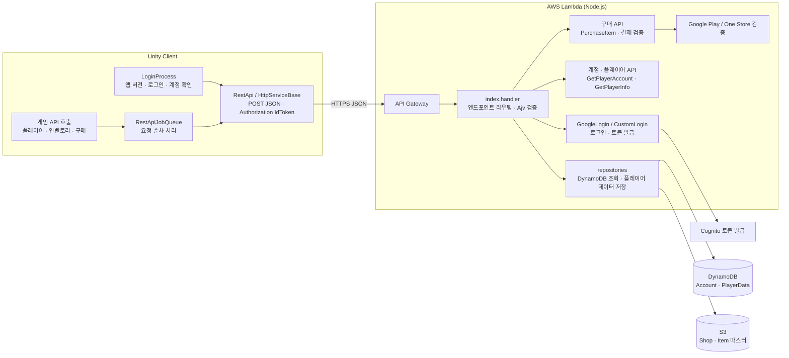

# ⛏️ 광여전사 키우기 REST API 샘플

> 상용 Unity 모바일 RPG **광여전사 키우기**(서비스 중)에서 사용하는 클라이언트-서버 통신 구조를 포트폴리오용으로 재구성한 샘플입니다.

Unity 클라이언트가 AWS Lambda 기반 백엔드와 REST API로 통신하는 흐름을 보여줍니다. 서버 권한 기반 구매 처리, 결제 영수증 검증과 중복 지급 방지, 구매 제한, 인벤토리 동기화 구조를 중심으로 구성했습니다.

- 출시 앱: https://play.google.com/store/apps/details?id=com.onethesoft.MiningWarrior&hl=ko

## 프로젝트 스펙

### Unity 클라이언트

- Unity Editor: `6000.3.8f1` (Unity 6)
- Language: C#
- REST transport: `UnityWebRequest`
- Serialization: `Newtonsoft.Json`
- Store integration: Unity IAP, One Store SDK

### AWS 서버리스 백엔드

- Entry point: AWS API Gateway
- Compute: AWS Lambda, Node.js `22.x`
- Handler: `index.handler`
- Architecture: `x86_64`
- Authentication: Amazon Cognito
- Data: Amazon DynamoDB, Amazon S3
- Lambda layer: `ajv_nodejs18`

이 프로젝트는 Lightsail의 상시 실행 인스턴스나 nginx/PM2를 사용하지 않는다. API Gateway가 Lambda를 호출하고, Lambda가 DynamoDB와 S3에 접근하는 서버리스 구조다.

## 기술 스택

- **Client**: Unity 6, C#, UnityWebRequest, Newtonsoft.Json
- **Client architecture**: `LoginProcess`, `RestApi`, `HttpServiceBase`, REST API callback flow
- **Runtime**: Node.js `22.x`, AWS Lambda
- **API**: Amazon API Gateway, JSON over HTTPS, POST endpoint
- **Authentication**: Google Play Games login, Amazon Cognito token
- **Storage**: Amazon DynamoDB, Amazon S3
- **Validation**: Ajv JSON schema validation
- **Payments**: Google Play Billing, One Store, server-side receipt verification

## 아키텍처



## ✨ 주요 기능

- 🔐 **로그인/인증**: 게임 서버 이용을 위한 사용자 인증 처리
- 🛒 **상점 구매**: 게임 내 재화 상품 구매 및 결과 반영
- 💳 **결제 검증**: Google Play / One Store 인앱 결제 영수증 검증
- 🎁 **보상 지급**: 구매 성공 시 아이템 지급 결과 동기화
- ⏳ **구매 제한**: 일일/주간/월간/영구 구매 제한 처리
- 🚫 **예외 처리**: 재화 부족, 잘못된 요청, 정지 계정 등 오류 응답 처리

## 🔑 로그인 진입 흐름

실제 `MiningWarrior`의 앱 실행부터 인게임 진입까지의 흐름입니다.

```text
앱 실행
  ↓
LoginProcess 시작
  ↓
앱 버전 및 서버 점검 상태 확인
  ├─ 업데이트 필요 → 스토어 이동
  ├─ 서버 점검 중   → 점검 안내 후 종료
  └─ 정상
      ↓
로그인
  ├─ Unity Editor → CustomLogin
  └─ Android      → Google Play 인증 → GoogleLogin
      ↓
플레이어 계정 불러오기
  ├─ 탈퇴 예약 계정 → 탈퇴 취소 여부 확인
  ├─ 이용 정지 계정 → 정지 안내 후 종료
  └─ 정상
      ↓
필수 약관 동의 확인 및 계정 정보 저장
      ↓
SNS·디바이스 정보 저장 및 추가 리소스 다운로드
      ↓
서버 목록 불러오기
  ├─ 서버가 여러 개 → 서버 선택
  └─ 서버가 하나     → 자동 선택
      ↓
선택한 서버 정보 저장
      ↓
플레이어 정보 불러오기 → PlayerManager 반영
      ↓
닉네임·프롤로그 처리
      ↓
Main 씬 로드
      ↓
인게임 진입
```

샘플의 `LoginProcess`는 이 진입 순서를 중심으로 구성하고, 실제 네트워크 호출은 `RestApi → HttpServiceBase` 계층으로 분리했습니다. Google Play·UI 팝업·Addressable·SNS SDK는 포트폴리오 샘플에서 이벤트와 콜백으로 대체했습니다.

## 🎮 Unity SampleView

서버 API 구조뿐 아니라 Unity 화면에서 사용자가 버튼을 눌렀을 때 어떤 순서로 서버 기능이 호출되는지도 함께 보여줍니다.

- `ShopPurchaseSampleView.cs`: 상점 상품 버튼 클릭 → `PurchaseItemCommand` 큐 등록 → 서버 구매 검증 → 인벤토리 UI 반영
- `PurchaseValidationSampleView.cs`: Unity IAP 결제 결과 수신 → Google Play 영수증 서버 검증 요청 → 검증 성공 후 보상 동기화

결제 보상은 클라이언트에서 직접 지급하지 않고, 서버 검증 결과를 기준으로 인벤토리에 반영하는 흐름으로 구성했습니다.
## 🚀 API 흐름

### 1. 로그인

Unity 클라이언트는 원본과 동일하게 플랫폼별 로그인 API를 호출합니다. Android에서는 Google Play Games의 server-side authorization code를 전달하고, Editor에서는 `CustomLogin`을 사용합니다. 서버는 provider 사용자 식별자를 내부 플레이어 식별자로 변환하고 Cognito 세션을 발급합니다.

```text
Unity Editor → CustomLogin
Android
  → Google Play Games Authenticate
  → RequestServerSideAccess
  → GoogleLogin API
      → Provider 사용자 식별자 변환
      → Cognito 로그인/가입
  → PlayerId, IdToken, AccessToken, RefreshToken 반환
```

관련 파일:

- `Unity/Runtime/Login/LoginProcess.cs`
- `Unity/Runtime/Network/RestApi.cs`
- `Unity/Runtime/Network/HttpServiceBase.cs`
- `Unity/Runtime/Network/LoginApi.cs`
- `Lambda/handlers/googleLogin.mjs` (GoogleLogin handler)
- `Lambda/shared/authService.mjs`

### 2. 일반 재화 구매

클라이언트는 구매할 상점 ID와 상품 ID 목록을 서버로 전달합니다. 서버는 플레이어 계정 상태, 선택 서버, 보유 재화, 상점 데이터, 아이템 데이터를 검증한 뒤 인벤토리를 갱신하고 변경 결과를 반환합니다.

```text
구매 버튼 클릭
  → PurchaseItemCommand 큐 등록
  → PurchaseItem API 호출
  → 서버에서 재화/상점/아이템 검증
  → DynamoDB 플레이어 데이터 갱신
  → 클라이언트 인벤토리 동기화
```

관련 파일:

- `Unity/Runtime/Network/PurchaseItemApi.cs`
- `Unity/Runtime/Network/PurchaseItemCommand.cs`
- `Lambda/handlers/purchaseItem.mjs`
- `Lambda/shared/inventoryService.mjs`

### 3. Google Play 결제 검증

Unity IAP에서 발생한 pending order의 영수증을 서버로 전송합니다. 서버는 Google Play Developer API로 영수증을 검증한 뒤, 검증된 상품에 대해서만 보상을 지급합니다. 클라이언트는 서버 검증이 성공한 후 Unity IAP pending order를 confirm합니다.

```text
Unity IAP 구매 완료
  → PendingOrder 수신
  → ValidateGooglePlayPurchase API 호출
  → Google Play Developer API 검증
  → 서버 보상 지급
  → 클라이언트 인벤토리 반영
  → ConfirmPurchase 호출
```

관련 파일:

- `Unity/Runtime/Network/UnityIapGooglePurchaseService.cs`
- `Unity/Runtime/Network/ValidatePurchaseApi.cs`
- `Unity/Runtime/Network/ValidatePurchaseCommand.cs`
- `Lambda/handlers/validateGooglePurchase.mjs`
- `Lambda/shared/storeVerification.mjs`

### 4. One Store 결제 검증

One Store SDK에서 반환한 구매 정보를 서버로 전송합니다. 서버는 One Store API를 통해 결제 정보를 검증 및 consume 처리한 뒤, 검증된 상품에 대해서만 보상을 지급합니다.

```text
One Store 구매 완료
  → PurchaseData 수신
  → ValidateOneStorePurchase API 호출
  → One Store API 검증 및 consume
  → 서버 보상 지급
  → 클라이언트 인벤토리 반영
```

관련 파일:

- `Unity/Runtime/Network/OneStorePurchaseService.cs`
- `Unity/Runtime/Network/ValidatePurchaseApi.cs`
- `Lambda/handlers/validateOneStorePurchase.mjs`
- `Lambda/shared/storeVerification.mjs`

## 📁 프로젝트 구조

```text
Unity/
  Runtime/
    Login/
      AppVersion.cs                   # 앱 버전·점검 상태 모델
      LoginProcess.cs                 # 실제 LoginProcess 기반 첫 씬 진입 흐름
    Network/
      ApiError.cs                       # 에러 모델, ApiErrorCode, IsRetryable
      ApiClientBootstrap.cs             # 씬에서 HttpServiceBase/SessionStore 생성
      ApiResponse.cs                    # 공통 응답 래퍼
      ApiRequestQueue.cs                # 순차 API 요청 큐, 실패 시 잔여 취소
      AuthType.cs                       # 인증 타입
      IApiRequest.cs                    # API 요청 인터페이스·원본 요청 직렬화 확장
      ISessionStore.cs                  # 세션 저장소 인터페이스
      LoginApi.cs                       # GoogleLogin/CustomLogin 요청·응답 모델
      LoginFlowApi.cs                   # 버전·계정·서버·PlayerInfo API 모델·원본 응답 형태
      RestApi.cs                        # 원본 RestApi facade, 엔드포인트별 호출
      HttpServiceBase.cs                # 세션·공통 HTTP 실행 계층
      PurchaseItemApi.cs                # 일반 구매 요청/응답 모델
      PurchaseItemCommand.cs            # 구매 API 실행 및 인벤토리 반영
      StorePurchaseService.cs           # 스토어 결제 공통 서비스
      StoreReceiptModels.cs             # 영수증 모델
      UnityIapGooglePurchaseService.cs  # Google Play 결제 처리
      OneStorePurchaseService.cs        # One Store 결제 처리
      ValidatePurchaseApi.cs            # 결제 검증 요청/응답 모델
      ValidatePurchaseCommand.cs        # 결제 검증 API 실행
      SessionStore.cs                   # 세션 저장 구현
      UnityRestClient.cs                # UnityWebRequest REST 클라이언트, Idempotency-Key, 5xx 재시도
    Player/
      PlayerInfo.cs                     # AccountData/PlayerInfo 상태 모델
      PlayerManager.cs                  # 현재 플레이어 보관소
  SampleView/
    ShopPurchaseSampleView.cs           # 상점 구매 → 큐 → 결과/실패 UI
    PurchaseValidationSampleView.cs     # 영수증 검증 → 보상 반영

Lambda/
  package.json                          # Lambda 런타임 의존성
  handlers/                             # API Gateway 엔드포인트별 Lambda handler
    googleLogin.mjs                     # Google provider 로그인 및 Cognito 세션 발급
    customLogin.mjs                     # Editor용 CustomLogin 및 Cognito 세션 발급
    getAppVersion.mjs                   # 앱 버전·점검 상태 반환
    getPlayerAccount.mjs                # 계정 상태 조회
    updatePlayerAccount.mjs             # 약관·서버·SNS·디바이스 정보 갱신
    getServerData.mjs                   # 서버 목록·서버 상태 조회
    getPlayerInfo.mjs                   # 선택 서버의 플레이어 데이터 조회
    purchaseItem.mjs                    # 일반 재화 구매 처리
    validateGooglePurchase.mjs          # Google Play 영수증 검증
    validateOneStorePurchase.mjs        # One Store 영수증 검증

  shared/
    apiResponse.mjs                     # 공통 응답 생성, ErrorCode
    iapGrantService.mjs                 # 영수증 검증 → 중복 방지 → 지급 공통 흐름
    authService.mjs                     # Cognito 인증 처리
    iapRewardService.mjs                # IAP 보상 계산
    inventoryService.mjs                # 아이템 지급/재화 차감
    logger.mjs                          # 로깅 유틸
    request.mjs                         # API Gateway body·Cognito PlayerId 처리
    purchaseLimitService.mjs            # 구매 제한 검증
      repositories.mjs                    # Account/PlayerData·서버 목록 DynamoDB/S3 접근
    storeVerification.mjs               # 스토어 영수증 검증
```

## 에러 코드

| retCode | 의미 | 클라이언트 처리 |
|---|---|---|
| 0 | Success | |
| 1 | InvalidInput | 요청 형식/데이터 오류 — 로그 |
| 2 | NotAuthorized | 토큰 갱신 후 재시도, 실패 시 로그인 화면 |
| 3 | AccountNotFound | 가입 흐름으로 |
| 4 | InternalServerError | 같은 `Idempotency-Key` 로 재시도 |
| 5 | LackResources | 재화 부족 UI |
| 6 | BannedPlayer | 정지 안내 |
| 7 | Conflict | 플레이어 데이터 재조회 후 재시도 |
| 8 | InvalidPurchase | 스토어가 거부한 영수증 — 재시도 금지 |
| 9 | PurchaseLimitExceeded | 구매 제한 UI |

## 🔐 보안 및 공개 범위

이 저장소는 포트폴리오 공개를 위해 재작성된 샘플입니다. 실제 운영 프로젝트의 민감 정보는 포함하지 않았습니다.

제거 또는 샘플화한 항목:

- 실제 AWS 계정 정보
- AWS Access Key / Secret Key
- API Gateway 실제 엔드포인트
- Cognito User Pool ID / App Client ID
- DynamoDB 실제 테이블명
- S3 실제 버킷명
- Google Play 서비스 계정 키
- One Store client secret
- 실제 상품 ID 및 라이브 서비스 데이터

서버에서 필요한 값은 환경변수나 Secret Manager를 통해 주입하는 것을 전제로 작성했습니다.

## 📌 안내

이 저장소는 전체 실행 가능한 Unity 프로젝트나 Lambda 배포 패키지가 아니라, 구조와 설계 흐름을 보여주기 위한 코드 샘플입니다.

실제 실행을 위해서는 Unity 프로젝트 설정, Unity IAP/One Store SDK, Lambda 배포 설정, AWS 리소스, 스토어 API 인증 정보가 별도로 필요합니다.

## 원본 프로젝트에서 더 다룬 것 (이 샘플에 없는 부분)

- **인증**: Google Play Games 인증 코드 → Cognito 사용자 풀 로그인/가입, 토큰 갱신
- **API 구성**: 로그인/토큰 갱신, 서버 시간, 앱 버전 확인, 닉네임, 인벤토리·플레이어 데이터 조회/저장, 상점 구매, Google Play 결제 검증, 쿠폰 조회/사용 등 13종. 재화·결제처럼 돈이 걸린 경로만 서버 권한으로 두고, 나머지 진행 데이터는 클라이언트가 계산해 `SetPlayerData` 로 저장하는 하이브리드 구조
- **운영 기능**: 랭킹, 푸시 알림(Amazon SNS), 점검 모드, 쿠폰, 어드민 로그인
- **인프라**: API Gateway + Lambda + DynamoDB + S3, 스테이지(dev/prod) 분리, 환경변수/Secret Manager 로 키 주입
